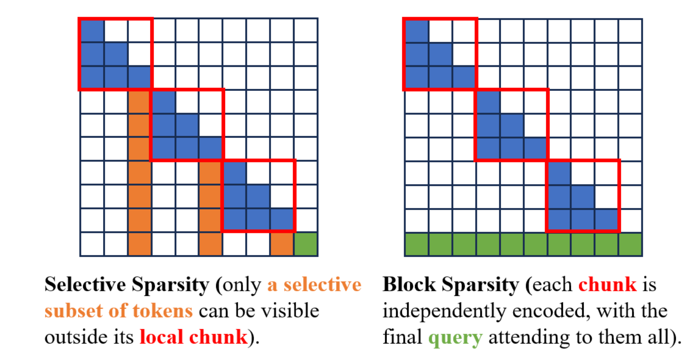
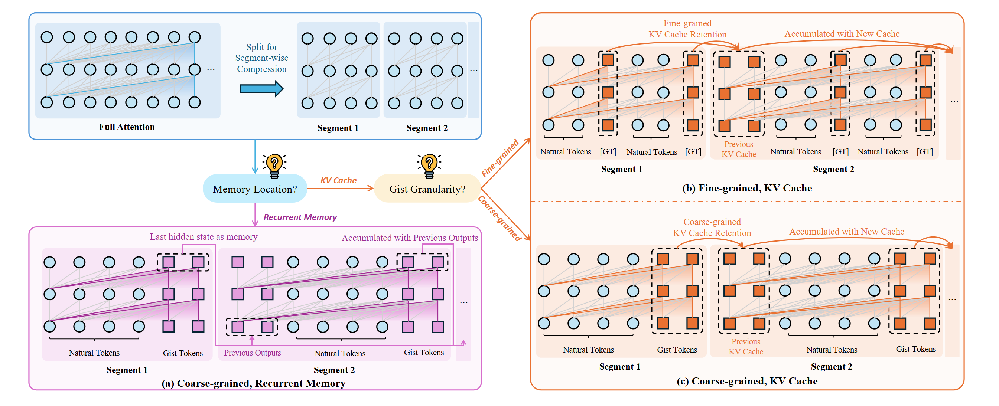
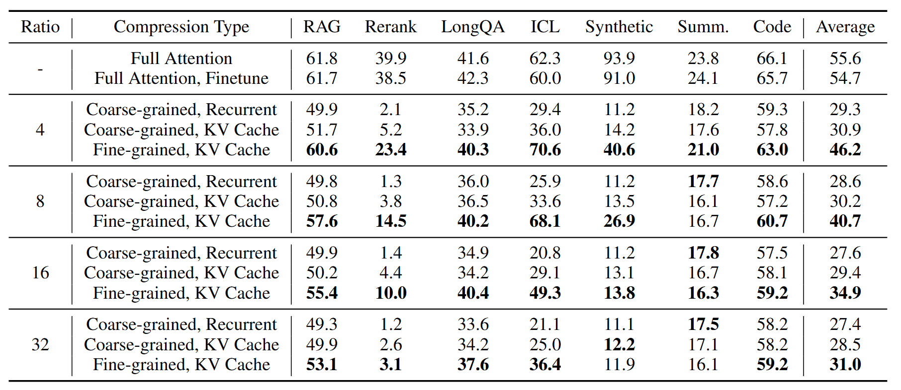
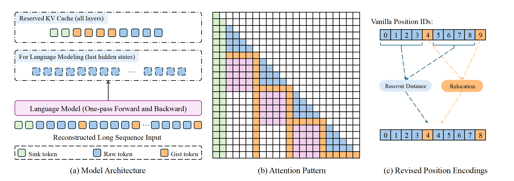
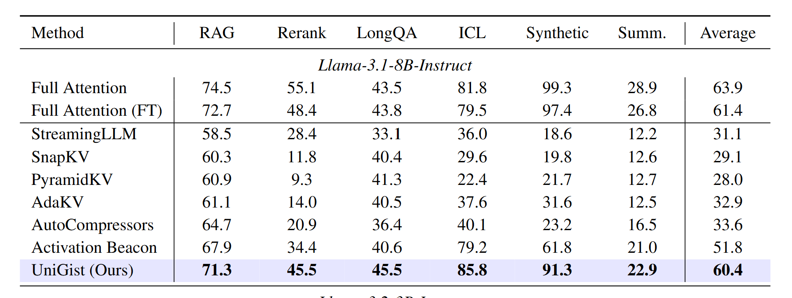
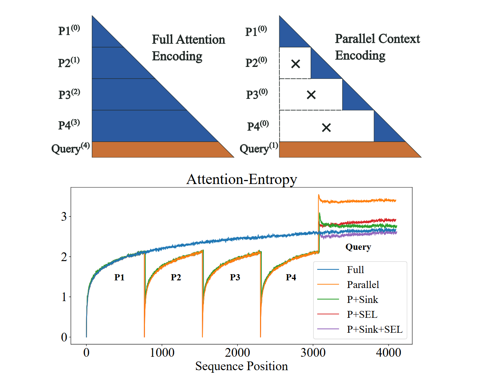
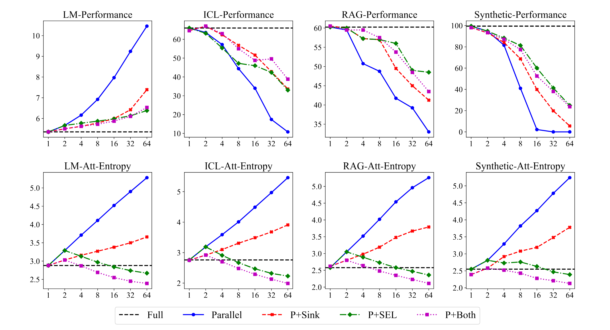
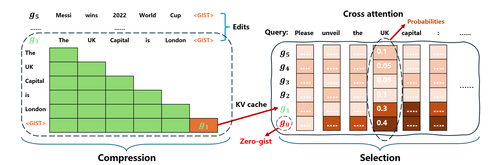
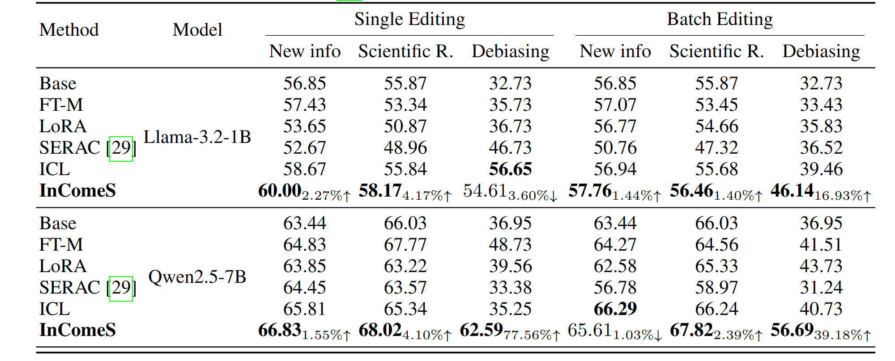

# A Slight Summary of Our Recent Work Related to Sparse Attention

(by zs, 15 Dec. 2025)

## 1. Introduction

Starting from the introduction of the full attention mechanism in [Transformer](https://arxiv.org/pdf/1706.03762), there have been lots of variations and modifications on the attention mechanism. See related surveys for more details, for example, [an earlier one](https://arxiv.org/pdf/2009.06732) and [a recent one](https://arxiv.org/pdf/2508.09834). One interesting direction is to incorporate sparsity to tackle the inefficiency issue of the full attention. The full attention needs to calculate attention weights between each pair of tokens in the sequence, bringing costs in two ways: 1) the O(N^2) computational cost, 2) the O(N) memory cost. With the development of LLMs, these issues become more severe when dealing with long sequences. Sparsity is a natural choice to tackle these problems, with the motivation that we do not need to calculate all N^2 attention interactions to achieve good sequence modeling.

## 2. Preliminaries

Here, we slightly describe the process of sequence modeling and generation in the context of auto-regressive decoder-only Transformer (GPT-styled) architecture. Assuming we have an input prompt of $(x_0, x_1, x_2, ..., x_{n-1})$ and the model will generate the output $(x_n, x_{n+1}, ...)$ that continues the input prompt. A key component in the Transformer is the self-attention module, where each token will need to "attend" to all previous tokens to calculate their next hidden representations: $attn(Q, K, V) = softmax(\frac{QK^T}{\sqrt{d_k}})V$. Here, for each token (as the Query Q), it needs to compute with all previous tokens as Keys and Values (KVs). PyTorch's [scaled_dot_product_attention](https://docs.pytorch.org/docs/stable/generated/torch.nn.functional.scaled_dot_product_attention.html) API page is a good reference to understand this process.

You can see where the costs come from: 1) from the perspective of computation, it requires computation for each pair of query and key/value, resulting in O(N^2) complexity, 2) from the perspective of memory, we need to store all the KVs from previous tokens, resulting in O(N) memory cost. Sparsity can help here by removing certain calculations and KV storage.

## 3. Sparsity Patterns

We will mainly talk about two types of sparsity patterns: selective sparsity and block sparsity, as illustrated in the figure above. Selective sparsity means that for each of the query token, it is only allowed to attend to a subset of previous tokens. Here, we are mainly interested at one specific selective pattern: using a special token to represent a block of raw tokens, and let future tokens to attend to only these special tokens. This scheme can also reduce memory cost since there will no need to store the KV cache of all the raw tokens (basically it is compressing KV cache). The second scheme takes another perspective, that is, specifying some blocks and only allow intra-block attention for these blocks. Global attention will only be enabled for the final query tokens.

## 4. Our Work

### 4.1. Gist-based Compression

(From "A Silver Bullet or a Compromise for Full Attention? A Comprehensive Study of Gist Token-based Context Compression", [[Paper Link]](https://arxiv.org/pdf/2412.17483))

Corresponding to the first sparsity pattern, we investigate and compare several different approaches of adding such special tokens (referred to as gist tokens). In this work, we provide a thorough investigation of gist-based context compression methods to improve long-context processing in large language models.

Here, long texts are segmented for compression, enabling diverse architectures through different memory locations and gist granularity. We mainly explore three patterns: recurrent memory (more like RNN, compressed representations are outputs of the model and fed to the input of later segments), KV Cache compression (sparsity-attention based) with coarse-granularity and fine-granularity.

Through extensive experiments, we show that the fine-grained KV Cache-based approach performs the best. Overall, while gist-based compression can achieve near-lossless performance on tasks like retrieval-augmented generation and long-document QA, but it faces challenges in tasks like synthetic recall. Furthermore, we identify various key failure patterns: lost by the boundary, lost if surprised, and lost along the way.

### 4.2. UniGist

(From "UniGist: Towards General and Hardware-aligned Sequence-level Long Context Compression", [[Paper Link]](https://arxiv.org/pdf/2509.15763))

Extending this line of research, we further investigate how to improve the overall results of the gist-based compression approaches. To address this, we propose UniGist, a sequence-level compression method with a unified sparse gist layout, enabling effective and efficient long context modeling without chunk-wise training.

Here, we (a) adopt a chunk-free training strategy that allows one-pass sequence processing, (b) design a gist-enhanced attention pattern to effectively aggregate information, and (c) revise positional encoding to maintain the relevant distances between raw tokens.

The results show the effectiveness of the proposed approach. This suggests that our unified attention pattern design plays a key role in helping the model read compressed context effectively.

### 4.3. Attention Entropy is the Key Factor

(From "Attention Entropy is a Key Factor: An Analysis of Parallel Context Encoding with Full-attention-based Pre-trained Language Models", [[Paper Link]](https://arxiv.org/pdf/2412.16545))

For the direction of block sparsity, we provide an analysis of it with full-attention-based pre-trained language models. Because such pattern are not encountered during training, naively applying it leads to performance degradation.

Here, the upper sub-figures illustrate the full attention and block sparsity (parallel context encoding) schemes, with superscripts indicating positional encoding. The lower sub-figure demonstrates that block sparsity can result in irregularly high attention entropy for query tokens. In this example, the context is divided into four segments (P1–P4), which are individually encoded with the block sparsity scheme (upper right). These pieces correspond to the sub-regions in the lower sub-figure. We explore two methods to reduce entropy: `Sink` means adding attention sinks, and `SEL` means selective attention.

The result illustrates the effectiveness of the entropy reduction methods. The overall trends are consistent across different tasks. Both shared sink tokens and selective attention can reduce attention entropy and enhance performance compared to the naive parallel scheme, especially with higher parallel degrees. (And yes, it seems promising to combine selective and block sparsity!)

### 4.4. Gist-based Editing

(From "InComeS: Integrating Compression and Selection Mechanisms into LLMs for Efficient Model Editing", [[Paper Link]](https://arxiv.org/pdf/2505.22156))

Finally, we can apply these techniques to the applications of model editing, which aims to precisely integrate updated knowledge into a model, enabling targeted behavioral modifications while maintaining performance on unrelated tasks.

This figure illustrate our overall scheme. It can be viewed as a combination of block sparsity and selective sparsity. First, each edit sequence is handled independently, with the parallel encoding scheme of block attention. Moreover, each edit sequence is compressed into one gist token for future use, which is exactly what we've done in gist-based approaches.

One of our method's advantages is its flexibility in handling a variety of editing contexts with different formats, including edits in free-text forms without explicitly labeled subjects and objects. To verify our method's capability for such scenarios, we adopt the DUNE dataset, which includes natural-language form edits, and the result confirms our method’s capability to handle natural language edits.

## 5. Discussions

Generally, sparse attention has been an interesting and fast-moving direction, where there have been much interesting research work. Our work only touches a small portion of the potential designs, while there can be many more interesting patterns to investigate.
